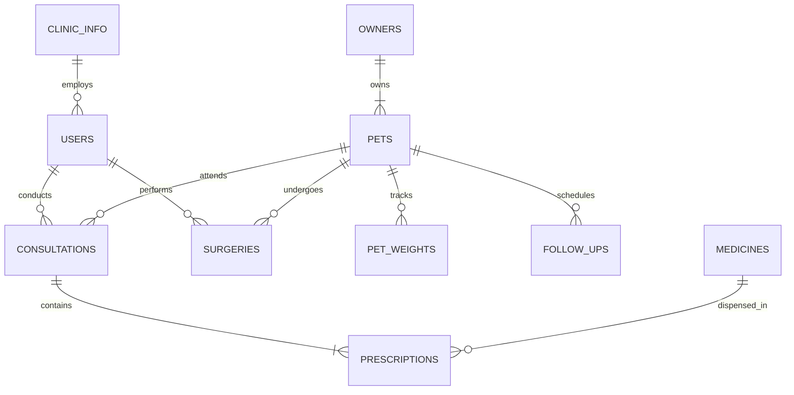

# 🐾 VetPulse: Architectural Specification & Implementation Report

> **Offline-First Veterinary Clinic & Patient Management System**  
> **Tech Stack:** Flutter 3.x (Dart 3.x) • GetX (State, Navigation, DI) • Local SQLite (`sqflite` + `sqflite_common_ffi`)  
> **Target UX:** 100% Arabic Native UI (`ar_SA`) • RTL Responsive • Clinical Medical Aesthetic  
> **Repository:** `vet_pulse`

---

## 1. System Overview

**VetPulse** (`vet_pulse`) is an offline-first clinical workstation engineered specifically for veterinary practitioners and clinic administrative staff. The application removes external cloud or network dependencies by storing all records locally in an encrypted, relational SQLite database with strict foreign key constraints.

The application follows the **GetX Clean Architecture pattern**, cleanly dividing responsibilities across presentation views, reactive controllers, dependency injection bindings, and robust data repositories.

---

## 2. Design System & Clinical Aesthetic

```
Primary (Clinical Teal)        #0E8388  ██████  Authority, cleanliness, calm
Secondary (Soft Mint)         #CBE4DE  ██████  Accent chips, active toggles, cards
Dark Neutral (Deep Slate)     #2E4F4F  ██████  High contrast typography, headers
Background (Snow Off-White)   #F8FAFC  ██████  Eye strain reduction during shifts
Surface (Pure White)          #FFFFFF  ██████  Elevation cards with subtle shadows
Critical / Expired            #E63946  ██████  Allergies, expired drug alerts
Pending / Warning             #F4A261  ██████  Near-expiry, upcoming follow-ups
Completed / In-Stock          #2A9D8F  ██████  Normal vitals, in-stock medicines
```

- **RTL Typography:** Powered by `GoogleFonts.cairo()` with right-to-left layout direction (`Locale('ar', 'SA')`).
- **Responsive RTL Adapters:** Back chevrons, icons, table headers, and form inputs automatically adapt to native RTL flow.

---

## 3. Relational SQLite Schema

The local database (`vet_pulse.db`) contains 10 relational tables initialized with `PRAGMA foreign_keys = ON;`:



### Table Directory
1. `clinic_info`: Clinic branding, doctor metadata, contact details, and license.
2. `users`: Multi-role staff directory (Lead Doctor, Assistant Vet, Receptionist, Pharmacist) with PIN codes.
3. `owners`: Pet owner client database with primary/secondary phone numbers and addresses.
4. `pets`: Patient directory with species, breed, gender, spay/neuter status, microchip index, and **critical drug allergies**.
5. `pet_weights`: Longitudinal weight records for growth and weight change monitoring.
6. `medicines`: Dual-tier inventory tracking (**Clinic Shelf** vs. **Main Warehouse**), unit costs, sale prices, batch numbers, and expiration dates.
7. `consultations`: Veterinary SOAP notes (Subjective complaints, Objective findings, Assessment diagnosis, Plan) with vitals and examination costs.
8. `prescriptions`: Itemized medications dispensed per consultation with automatic deduction from clinic shelf inventory.
9. `follow_ups`: Scheduled re-visits (e.g. suture removal, booster vaccine, IV check) with direct Arabic WhatsApp reminder generation.
10. `surgeries`: Operating room bookings with comprehensive **Pre-Operative Safety Checklists**, anesthesia protocol logs, and post-op care notes.

---

## 4. Implemented Feature Modules

### Module 1: Authentication, Clinic Profile & PIN Lock
- **Lead Doctor Setup:** Initial clinic profile creation (name, doctor name, license number, contact info).
- **Fast 4-Digit PIN Unlock:** Instant unlocking between patients without re-authenticating with full passwords.
- **Permanent Auth Service:** In-memory session tracking and active user context for auditing.

### Module 2: Patient & Owner Management
- **Complete Patient Profiles:** Categorized by species (Cats, Dogs, Birds, Equine, Exotics) with age and neuter status.
- **Critical Drug Allergy Warning:** Prominent crimson alert banner on patient files (e.g. Penicillin hypersensitivity).
- **Longitudinal Weight Tracker:** Chronological weight log with trend indicators.
- **Owner Contacts:** Quick-action WhatsApp chat and direct phone dialing.

### Module 3: Consultations, SOAP Notes & Veterinary Dosage Calculator
- **SOAP Clinical Documentation:**
  - **S (Subjective):** Owner complaint and history.
  - **O (Objective):** Physical exam findings and vitals (Temp, Heart Rate, Respiration, Mucous Membranes).
  - **A (Assessment):** Confirmed or differential diagnosis.
  - **P (Plan):** Treatment protocol, home care orders, and follow-up timeline.
- **Interactive Veterinary Dosage Calculator:**
  $$\text{Dose Volume (ml)} = \frac{\text{Patient Weight (kg)} \times \text{Dose Rate (mg/kg)}}{\text{Drug Concentration (mg/ml)}}$$
- **Atomic Stock Deduction:** Prescribing a medicine automatically decrements clinic shelf stock in SQLite.

### Module 4: Pharmacy & Dual-Storage Inventory
- **Two-Tier Storage:**
  - **Clinic Shelf (صيدلية العيادة):** Active dispensing inventory.
  - **Main Warehouse (المستودع الرئيسي):** Bulk reserve cartons.
- **Internal Stock Transfer:** Formally transfers units from Warehouse to Shelf with atomic balance updates.
- **Batch Expiration Tracking:**
  - 🔴 **Expired:** Hard block in UI preventing selection in prescriptions.
  - 🟠 **Expiring in < 30 Days:** Warning tag for priority dispensing.
  - 🟢 **Valid.**

### Module 5: Follow-Up & WhatsApp Reminders
- **Categorized Re-visit Dashboard:**
  - 🔴 **Overdue (مراجعات متأخرة)**
  - 🟡 **Today (مراجعات اليوم)**
  - 🟢 **Upcoming (مراجعات قادمة)**
- **One-Tap WhatsApp Generator:** Pre-populated personalized Arabic reminder message with patient name, appointment date, and purpose.

### Module 6: Surgical Suite & Pre-Operative Safety
- **Operating Room Scheduler:** Bookings linked to lead surgeon, assistant, and pet ID.
- **Pre-Op Safety Checklist:**
  - [x] Fasting status verified (8-12 hours food withdrawal).
  - [x] Pre-anesthetic blood panel cleared (Liver & Kidney function).
  - [x] Anesthesia consent form signed by owner.
- **Anesthesia Protocol Logging:** Pre-medication, induction agents, and intra-operative monitoring.

### Module 7: Staff Management & Role-Based Access Control (RBAC)
- **Role Permissions:**
  - `lead_doctor`: Full clinical, inventory, financial, and user management authority.
  - `assistant_vet`: Consultations, surgeries, prescriptions (restricted from user management and base pricing).
  - `receptionist`: Patient/owner registrations and appointment scheduling (restricted from medical diagnoses).
  - `pharmacist`: Stock transfers, batch receiving, and inventory control.

### Module 8: Printable Arabic Prescriptions & Bluetooth Printing
- **Prescription Preview & PDF Generation:** Professional Arabic header with clinic logo, doctor details, pet info, vitals, diagnosis, and itemized medication grid with frequency and instructions.
- **Print & Share:** Integrated via `pdf` and `printing` packages with support for thermal receipt printers, PDF export, and direct sharing.

---

## 5. Verification & Test Summary

| Test Suite | Scope | Status | Result |
| :--- | :--- | :---: | :--- |
| **Static Analysis** | `dart analyze` / `flutter analyze` | ✅ Passed | 0 errors, 0 warnings, 0 lints |
| **Dosage Calculator** | Weight-based formula and edge cases (zero/negative) | ✅ Passed | 100% verified |
| **Arabic Date Helper** | Expiry status classification & relative day labels | ✅ Passed | 100% verified |
| **RBAC Matrix** | Lead Doctor, Assistant, Receptionist, Pharmacist | ✅ Passed | 100% verified |
| **Data Models** | Dual inventory aggregation, allergies, pre-op checks | ✅ Passed | 100% verified |

**Total Unit Tests:** 14/14 Passed (100%).
