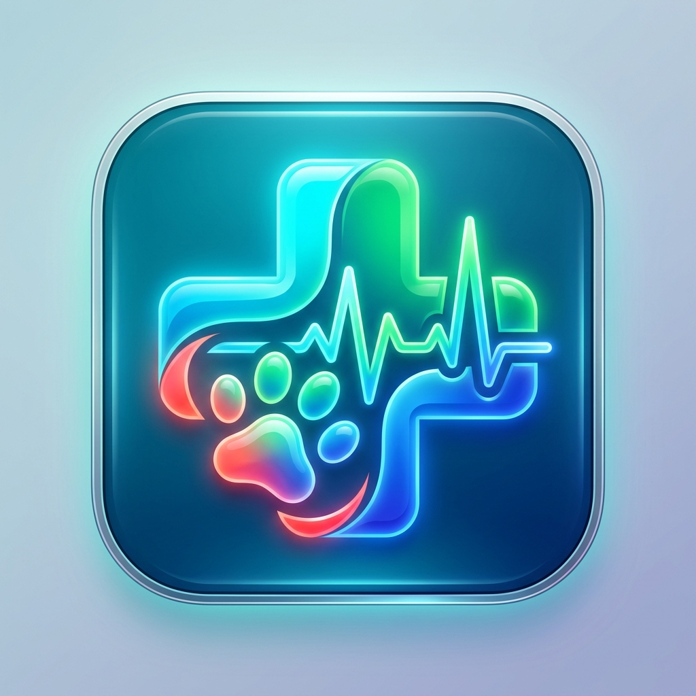
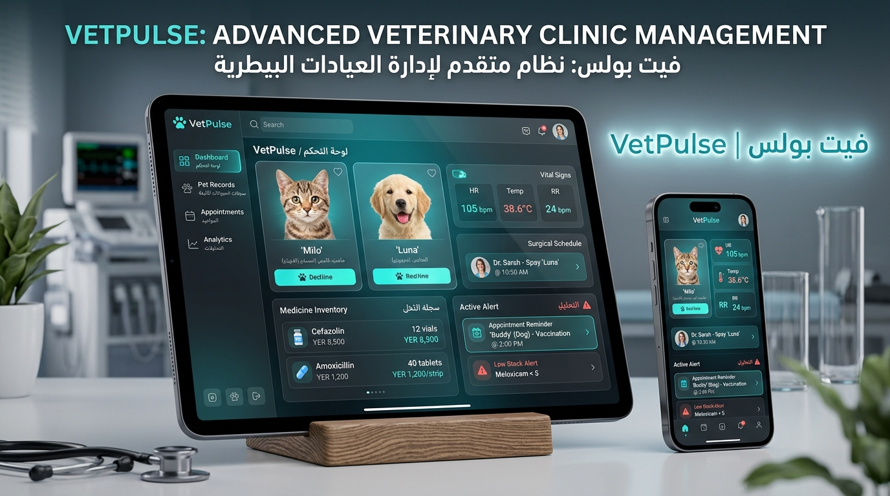
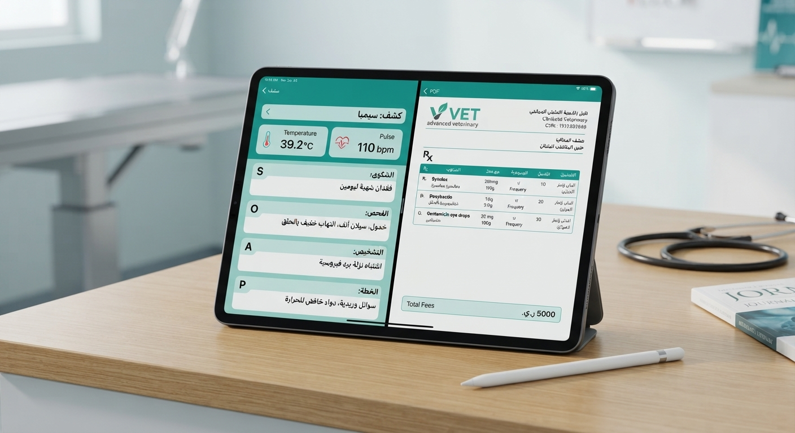
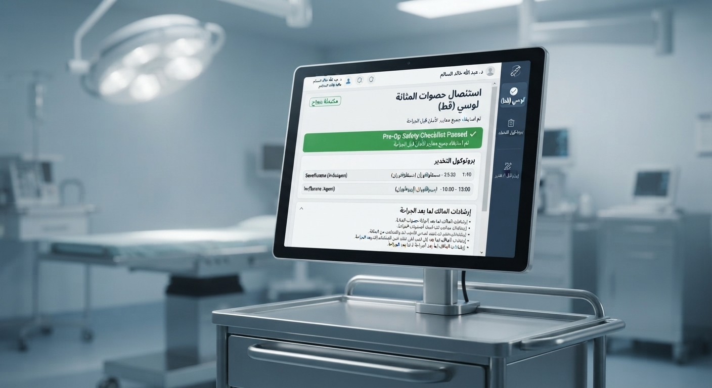
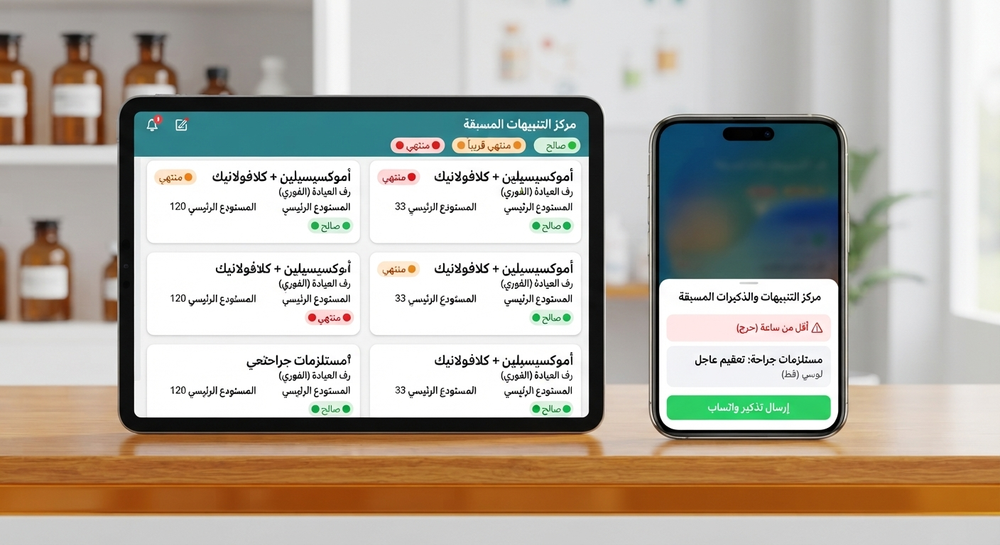

<!-- ======================================================================= -->
<!-- PAGE 1: COVER & PRESENTER INTRODUCTION -->
<!-- ======================================================================= -->

<h1 style="margin: 0; color: #0f766e; font-size: 22px; font-weight: 800;">نظام نبض البيطري | VetPulse</h1>

الجيل الذكي لإدارة العيادات والمراكز البيطرية • يعمل 100% بدون إنترنت

الصفحة 1 • الغلاف التقديمي

إعداد وتقديم النظام
<h2 style="margin: 4px 0 2px 0; font-size: 18px; color: #2dd4bf;">مهندس برمجيات / عبدالله عبدالمغني الأديمي</h2>

استشاري ومطور الحلول البرمجية والأنظمة الطبية التخصصية

المشروع الموجه لـ:

العيادات والمراكز البيطرية الرائدة

النسخة التجريبية الأولى Demo 1.0

⚡ أوفلاين 100%

يعمل محلياً عبر محرك SQLite

💰 الريال اليمني

حسابات دقيقة بـ (ر.ي / YER)

📄 روشتات PDF

طباعة ومشاركة واتساب فورية

🔔 تنبيهات ذكية

إشعارات المواعيد (12س / 6س / 1س)

نظام نبض البيطري (VetPulse) • عرض خاص للعميل المحتمل الأول
إعداد: م. عبدالله عبدالمغني الأديمي

<!-- ======================================================================= -->
<!-- PAGE 2: PROBLEM VS VETPULSE SOLUTION -->
<!-- ======================================================================= -->

<h2 style="margin: 0; color: #0369a1; font-size: 18px; font-weight: 800;">لماذا يحتاج مركزكم البيطري إلى نظام VetPulse؟</h2>

مقارنة التحديات اليومية للعيادات مع الحلول الرقمية المتقدمة

الصفحة 2 • المشاكل والحلول

تواجه معظم العيادات والمراكز البيطرية عائقين رئيسيين: <strong>انقطاع خدمات الإنترنت أو بطئها</strong> مما يعطل الأنظمة السحابية، و<strong>ضياع السجلات الورقية</strong> للمرضى وتواريخ التطعيمات. نظام <strong>VetPulse</strong> تم تصميمه هندسياً لحل هذه العقبات بالكامل وبأعلى كفاءة.

<table style="width: 100%; border-collapse: separate; border-spacing: 0 8px; font-size: 11.5px;">
<tr style="background: white; box-shadow: 0 2px 4px rgba(0,0,0,0.03);">
<td style="width: 25%; padding: 10px; background: #fee2e2; color: #dc2626; font-weight: bold; border-radius: 8px 0 0 8px; text-align: center; border: 1px solid #fecaca; border-left: none;">
❌ انقطاع الإنترنت
</td>
<td style="width: 40%; padding: 10px; color: #475569; border-top: 1px solid #e2e8f0; border-bottom: 1px solid #e2e8f0;">
توقف النظام تماماً عن حفظ الكشوفات أو مراجعة بيانات الحيوان عند غياب الشبكة.
</td>
<td style="width: 35%; padding: 10px; background: #ecfdf5; color: #059669; font-weight: bold; border-radius: 0 8px 8px 0; border: 1px solid #a7f3d0; border-right: none;">
✅ حل أوفلاين 100% بمحرك SQLite مشفر يعمل بدون إنترنت وبسرعة البرق
</td>
</tr>
<tr style="background: white; box-shadow: 0 2px 4px rgba(0,0,0,0.03);">
<td style="padding: 10px; background: #fee2e2; color: #dc2626; font-weight: bold; border-radius: 8px 0 0 8px; text-align: center; border: 1px solid #fecaca; border-left: none;">
❌ فقدان التاريخ الطبي
</td>
<td style="padding: 10px; color: #475569; border-top: 1px solid #e2e8f0; border-bottom: 1px solid #e2e8f0;">
عدم معرفة الأدوية التي تناولها الحيوان سابقاً، أو تكرار التحسس الدوائي لعدم التوثيق.
</td>
<td style="padding: 10px; background: #ecfdf5; color: #059669; font-weight: bold; border-radius: 0 8px 8px 0; border: 1px solid #a7f3d0; border-right: none;">
✅ ملف طبي شامل يبرز الحساسيات، منحنى الأوزان، وسجل العمليات
</td>
</tr>
<tr style="background: white; box-shadow: 0 2px 4px rgba(0,0,0,0.03);">
<td style="padding: 10px; background: #fee2e2; color: #dc2626; font-weight: bold; border-radius: 8px 0 0 8px; text-align: center; border: 1px solid #fecaca; border-left: none;">
❌ نسيان المواعيد
</td>
<td style="padding: 10px; color: #475569; border-top: 1px solid #e2e8f0; border-bottom: 1px solid #e2e8f0;">
تخلف المربين عن الحضور لجلسات التضميد، فك الخيوط الجراحية، أو الجرعات التنشيطية.
</td>
<td style="padding: 10px; background: #ecfdf5; color: #059669; font-weight: bold; border-radius: 0 8px 8px 0; border: 1px solid #a7f3d0; border-right: none;">
✅ مركز تنبيهات هاتفية ذكي (12س / 6س / 1س) وتذكيرات واتساب فورية
</td>
</tr>
<tr style="background: white; box-shadow: 0 2px 4px rgba(0,0,0,0.03);">
<td style="padding: 10px; background: #fee2e2; color: #dc2626; font-weight: bold; border-radius: 8px 0 0 8px; text-align: center; border: 1px solid #fecaca; border-left: none;">
❌ تسعير الأدوية والريال
</td>
<td style="padding: 10px; color: #475569; border-top: 1px solid #e2e8f0; border-bottom: 1px solid #e2e8f0;">
صعوبة ضبط تسعير الخدمات بالأدوية والمستلزمات واختلاف العملات.
</td>
<td style="padding: 10px; background: #ecfdf5; color: #059669; font-weight: bold; border-radius: 0 8px 8px 0; border: 1px solid #a7f3d0; border-right: none;">
✅ اعتماد الريال اليمني (ر.ي) مع خصم فوري من مخزون الصيدلية عند الكشف
</td>
</tr>
</table>

نظام نبض البيطري (VetPulse) • إعداد: م. عبدالله عبدالمغني الأديمي
صفحة 2 من 6

<!-- ======================================================================= -->
<!-- PAGE 3: CLINICAL MODULES & SOAP SYSTEM -->
<!-- ======================================================================= -->

<h2 style="margin: 0; color: #047857; font-size: 18px; font-weight: 800;">الوحدات السريرية والطبية التخصصية</h2>

نظام SOAP العالمي، الملف الطبي، وتوليد الروشتات الرقمية

الصفحة 3 • الميزات السريرية

<h3 style="margin: 0 0 4px 0; color: #065f46; font-size: 13px;">🩺 كشف سريري كامل بنظام SOAP</h3>

توثيق الشكوى (Subjective)، الفحص والحرارة والنبض (Objective)، التشخيص (Assessment)، وجدول العلاج (Plan).

<h3 style="margin: 0 0 4px 0; color: #065f46; font-size: 13px;">📁 الملف الطبي التكاملي للحيوان</h3>

شريط الحساسيات الدوائية التحذيري (Allergy Banner)، منحنى الوزن البيولوجي، وسجل العمليات والمراجعات السابقة.

<h3 style="margin: 0 0 4px 0; color: #065f46; font-size: 13px;">🖨️ طباعة وتصدير روشتات PDF عربية</h3>

روشتات رسمية بترويسة وشعار العيادة، تفصيل الجرعات والتكرار والمدة مع زر إرسال مباشر عبر <strong>واتساب</strong> للمربي.

<h3 style="margin: 0 0 4px 0; color: #065f46; font-size: 13px;">💊 الربط الصيدلاني والتسعير التلقائي</h3>

خصم فوري لكميات الأدوية من مخزون العيادة بمجرد اعتماد الكشف، وحساب إجمالي الفاتورة بدقة بـ <strong>الريال اليمني</strong>.

نظام نبض البيطري (VetPulse) • إعداد: م. عبدالله عبدالمغني الأديمي
صفحة 3 من 6

<!-- ======================================================================= -->
<!-- PAGE 4: SURGERY WING & DISCHARGE MANAGEMENT -->
<!-- ======================================================================= -->

<h2 style="margin: 0; color: #6d28d9; font-size: 18px; font-weight: 800;">جناح العمليات الجراحية والتخريج الطبي</h2>

إدارة التخدير، قائمة التحقق، وتوثيق إرشادات المالك لما بعد العملية

الصفحة 4 • العمليات الجراحية

1. قبل الجراحة (Pre-Op)

صيام 8 ساعات، تحاليل وظائف الأعضاء، وموافقة المالك.

2. أثناء الجراحة (Surgical)

بروتوكول التخدير (Sevoflurane)، الجراح، ومجريات العملية.

3. التخريج (Discharge)

تقييم الإفاقة، إرشادات المربي بالمنزل، وحجز المتابعة.

<h3 style="margin: 0 0 6px 0; color: #6d28d9; font-size: 12.5px;">🌟 شاشة إتمام وتخريج الجراحة المعتمدة (CompleteSurgeryView):</h3>

✔️ <strong>نتائج الجراحة والتعافي:</strong> توثيق نجاح العملية، استئصال الحصوات، وخياطة الجرح والإفاقة.

✔️ <strong>ملاحظات العناية للمالك:</strong> إرشادات ارتداء الطوق، تطهير الجرح، ومنع القفز والحركة.

✔️ <strong>حجز موعد المراجعة آلياً:</strong> جدولة موعد فك الغرز أو الكشف الدوري وإرساله للتنبيهات.

✔️ <strong>تثبيت التكلفة بالريال اليمني:</strong> اعتماد التكلفة النهائية وإصدار فاتورة إلكترونية معتمدة.

نظام نبض البيطري (VetPulse) • إعداد: م. عبدالله عبدالمغني الأديمي
صفحة 4 من 6

<!-- ======================================================================= -->
<!-- PAGE 5: PHARMACY, ALERTS, & ADMINISTRATIVE POWER -->
<!-- ======================================================================= -->

<h2 style="margin: 0; color: #b45309; font-size: 18px; font-weight: 800;">إدارة الصيدلية، المخزون المزدوج، والتنبيهات</h2>

التحكم المالي، مراقبة الصلاحيات، والتنبيهات المسبقة للمواعيد

الصفحة 5 • الصيدلية والتنبيهات

<h3 style="margin: 0 0 6px 0; color: #92400e; font-size: 13.5px;">📦 المخزون المزدوج (صيدلية العيادة + المستودع)</h3>

فصل احترافي بين الأدوية المتاحة على رفوف الكشف الفوري والمخزون الاحتياطي في المستودع:

<ul style="font-size: 10.5px; color: #334155; padding-right: 16px; margin: 0;">
<li>تحويل بضائع داخلي من المستودع إلى الصيدلية بنقرة واحدة.</li>
<li>تنبيهات تلقائية عند انخفاض المخزون عن الحد الأدنى الآمن.</li>
<li>رصد تاريخ الصلاحية وحساب فترات الركود والانتهاء المسبق.</li>
</ul>

<h3 style="margin: 0 0 6px 0; color: #92400e; font-size: 13.5px;">🔔 مركز التنبيهات متعدد المراحل الزمني</h3>

نظام ذكي يفرز المواعيد والعمليات القادمة حسب درجة الإلحاح:

<ul style="font-size: 10.5px; color: #334155; padding-right: 16px; margin: 0;">
<li><strong style="color: #dc2626;">أقل من ساعة (حرج ⚠️):</strong> تجهيز غرفة العمليات فوراً أو التواصل بالهاتف.</li>
<li><strong style="color: #d97706;">خلال 6 ساعات:</strong> التذكير المسبق وتأكيد حضور المربي.</li>
<li><strong style="color: #2563eb;">خلال 12 ساعة:</strong> المراجعات المجدولة للوردية القادمة.</li>
<li>إرسال تذكيرات هاتفية ورسائل واتساب مسبقة بضغطة زر.</li>
</ul>

نظام نبض البيطري (VetPulse) • إعداد: م. عبدالله عبدالمغني الأديمي
صفحة 5 من 6

<!-- ======================================================================= -->
<!-- PAGE 6: DEMO GUIDE & CLIENT IMPLEMENTATION PLAN -->
<!-- ======================================================================= -->

<h2 style="margin: 0; color: #115e59; font-size: 18px; font-weight: 800;">دليل تجربة نسخة العرض (Demo) وخطة التدشين</h2>

بيانات واقعية جاهزة للتجربة المباشرة وإمكانية إعادة التعيين بضغطة زر

الصفحة 6 • تجربة العرض والتدشين

<h3 style="margin: 0 0 8px 0; color: #0f766e; font-size: 13px;">🐾 الحالات الطبية النموذجية المجهزة للتجربة:</h3>

🐈 سيمبا (قط شيرازي)

المالك: م. أحمد الشامي • مصاب بالتهاب معوي حاد، جراحة حصوات، حساسية بنسلين وموعد مراجعة حرج اليوم.

🐕 روكي (كلب جيرمن شيبرد)

المالكة: د. ريم باعباد • تطعيم خماسي دوري + مضاد ديدان، وتتبع للأوزان (28.5 كجم) مع موعد مراجعة خلال 6 ساعات.

🐈 ميشو (قط بريطاني)

المالك: أ. طارق الحميري • مجدول لتنظيف الأسنان وإزالة التكلس، مع تنبيه مسبق خلال 12 ساعة.

🐈 لوزة (قطة سيامية)

المالكة: فاطمة اليماني • عملية تعقيم وقائي مجدولة غداً مع بروتوكول تخدير استنشاقي Sevoflurane.

🔄
<strong>ميزة إعادة ضبط بيانات العرض (Demo Reset):</strong> يمكنكم تجربة إضافة أو حذف أي سجل، ثم الضغط على زر <strong>"تهيئة البيانات"</strong> في أعلى الشاشة لإعادة كافة البيانات النموذجية فوراً!

<h3 style="margin: 0 0 4px 0; color: #2dd4bf; font-size: 15px;">جاهزون لتدشين النظام في عيادتكم الموقرة</h3>

يشمل العرض التثبيت على أجهزتكم، تدريب الطاقم الطبي والاستقبال، وتخصيص ترويسة الروشتة بشعاركم الرسمي.

كما نرفق لكم <strong>[نموذج طلب التعديلات والملاحظات]</strong> لتدوين أي رغبات إضافية لعيادتكم.

للتواصل المباشر والطلب:

م. عبدالله عبدالمغني الأديمي

مهندس برمجيات ومطور أنظمة

هاتف / واتساب • الجمهورية اليمنية

نظام نبض البيطري (VetPulse) • إعداد: م. عبدالله عبدالمغني الأديمي
صفحة 6 من 6 • نهاية العرض التقديمي

